## 提取项目流程

- 克隆项目到本地并安装依赖环境

  ```bash
  git clone https://github.com/jihainan/vue3-vite-web-template.git


## 开发环境配置

[VSCode](https://code.visualstudio.com/) + [Volar](https://marketplace.visualstudio.com/items?itemName=johnsoncodehk.volar)

- [vue-router](https://next.router.vuejs.org/zh/)
- [pinia](https://pinia.vuejs.org/)
- [arco-design](https://arco.design/vue/docs/start/)
- [TypeScript](https://www.tslang.cn/)

## vscode中需安装代码格式化的扩展插件

  - 注意：禁用vetur扩展

  - 在`vue`中加入对TS类型的支持

    默认情况下，TypeScript无法处理vue导入的类型信息, 因此，我们将'tsc'CLI替换为'vue tsc'以进行类型检查. 在开发中, 我们需要[TypeScript Vue Plugin (Volar)](https://marketplace.visualstudio.com/items?itemName=johnsoncodehk.vscode-typescript-vue-plugin) 使TypeScript语言服务基于vue类型.

    如果你觉得独立的TypeScript插件不够快，Volar还实现了一个 [Take Over Mode](https://github.com/johnsoncodehk/volar/discussions/471#discussioncomment-1361669) 更快的性能插件. 您可以通过以下步骤启用它:

    1. 禁用内置的TypeScript扩展
        1) 从VSCode的命令选项板输入 `Extensions: Show Built-in Extensions`
        2) 找到 `TypeScript and JavaScript Language Features`, 右键单击并选择 `Disable (Workspace)`
    2. 重启VSCode窗口，从命令选项板中运行 `Developer: Reload Window`

  - Vue Language Features (Volar):语法检查，支持vue3.0语法糖，如图：
     
     - 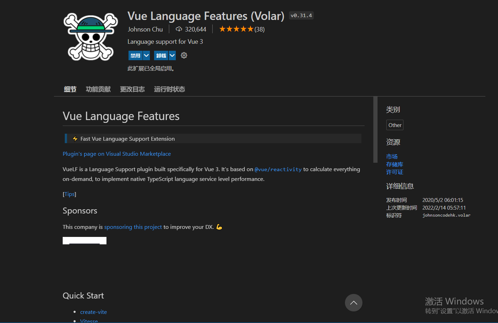
    
  - eslint:支持统一JavaScript代码风格的工具,会将有错的地方进行标记，如图：

     - 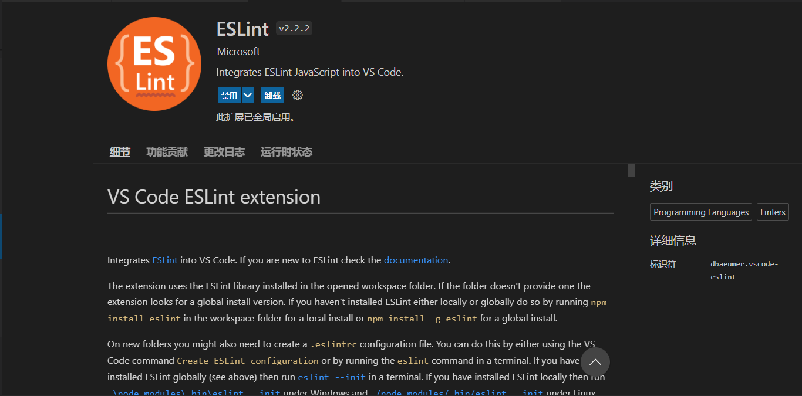

  - prettier:代码格式化的时候按照项目约定的规范进行代码美化,如图：

     - 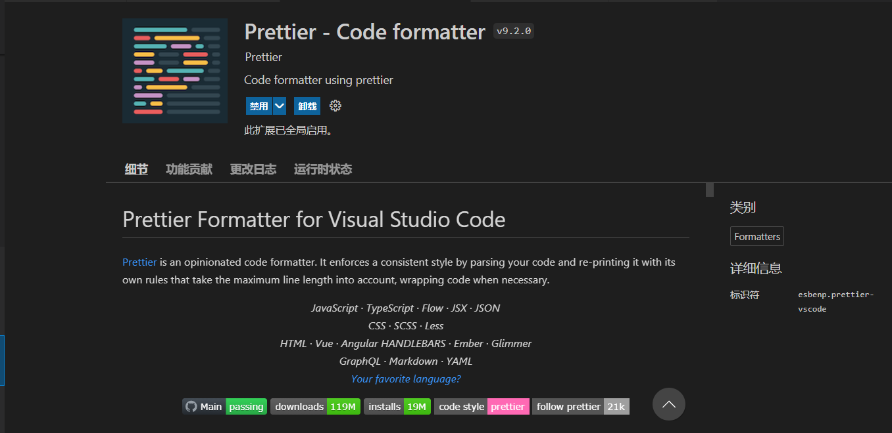

  - stylelint:检验CSS/SASS/LESS代码规范,如图：

     - 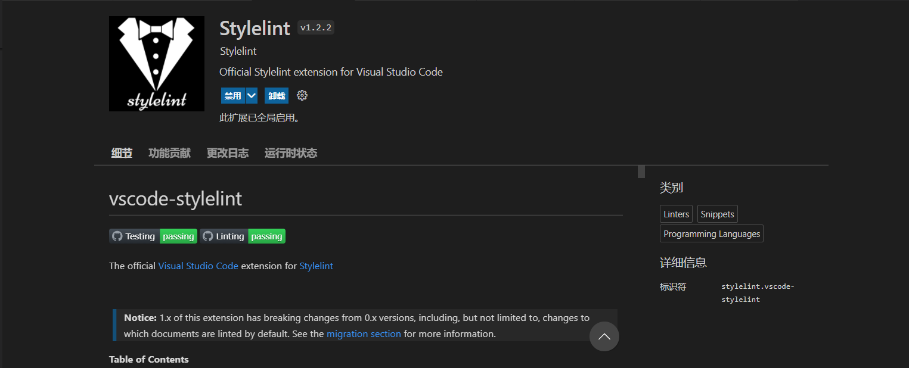

  - 上述扩展插件安装完成后，在vscode选项中找到文件>首选项>设置>打开setting.json(右上角图标),复制以下代码，可每次保存的时候将代码按eslint格式  
    进行修复:
      ```json
      {
        "editor.detectIndentation": false,
        "editor.tabSize": 2,
        "editor.formatOnSave": false,
        "editor.codeActionsOnSave": {
          "source.fixAll.eslint": true
        },
        "prettier.eslintIntegration": true
      }
      ```

## 安装依赖

  npm install

  安装成功，如图：
  - 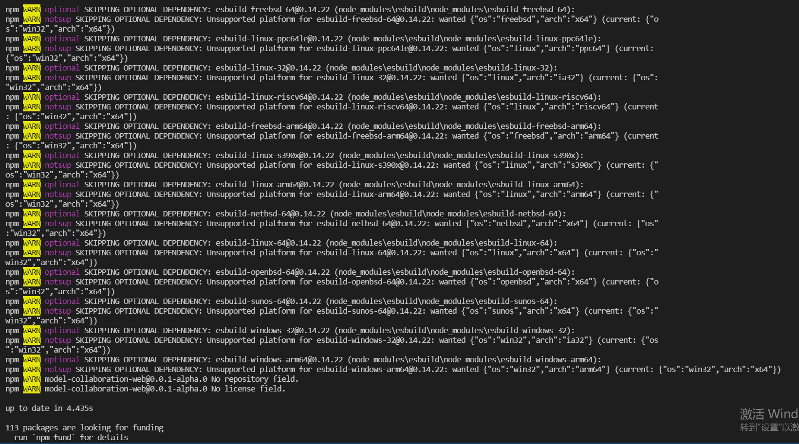

### 编译并启动项目

  ```sh
  npm run dev
  ```
  运行成功，如图：
    - 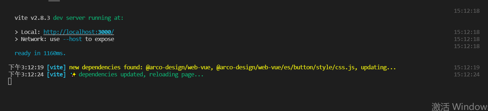


## 分支和代码提交规范

- 主要分支说明：

  - `master`

    开发分支，所有的功能开发和bug修改都基于该分支。

  - `production`

    部署分支，测试以及部署版本的更新全部基于该分支。

- 代码提交规范：

  所有的开发工作全部基于`master`分支。在进行新的功能开发或者bug修改之前，需要基于`origin/master`分支创建新的修改分支,代码修改期间，自行维护修改分支代码并及时同步`master`分支最新代码，在修改分支的工作完成后，向`master`分支提交合并请求，代表一次功能更新或者bug修改完成。
  分支被合并以后会自动删除，如需要再次修改相关代码，需要使用新的分支重新提交。
  
  - **分支命名规范**

    分支名称需要体现分支工作的内容，采用小写字母或数字加`-`的命名方式，避免使用自定义的缩写形式，常见的分支类型命名参考如下： 

    - bug修改类型分支
      
      例如：修复用户创建问题的分支可以命名为：`fix-user-create`

    - 已有功能优化类型分支

      例如：登录界面优化分支命名为：`opt-login-page`

    - 增加新功能类型分支

      例如：新增任务创建功能分支命名为：`feat-task-function`

    - 其他类型分支

      如果有重要的内容更新，例如框架调整、插件版本升级，需要结合具体内容进行分支的命名。
      例如：vue版本升级分支命名为：`vue-update-to-3.1.0`

  - **代码提交**
      
      - 在终端运行`git add .`命令(或者通过vscode选项板)把修改的文件暂存到更改区
        
        - 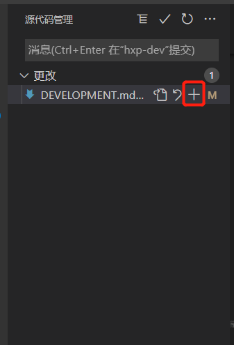
      
      - 在终端运行`npm run git:commit`命令，会有以下步骤：

        1. 根据提示选择要提交的更改主要目的type类型 
           - 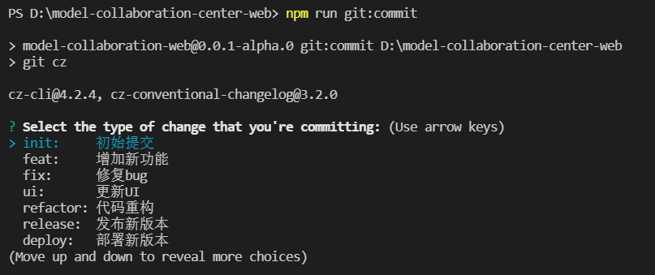
           其他type类型
           - 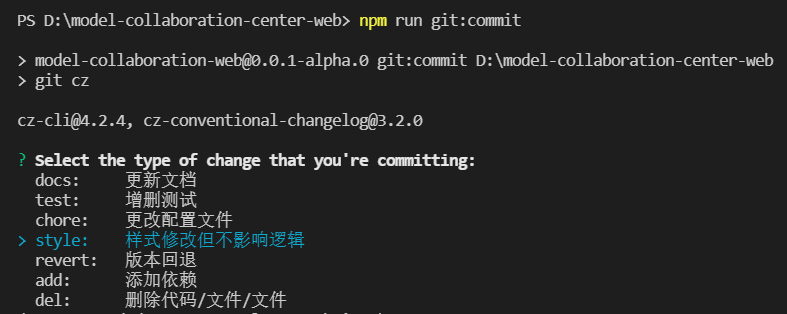
        
        2. 根据修改的组件或文件写出这次提交的影响范围，如修改的文件、组件或功能的名称等 
            - 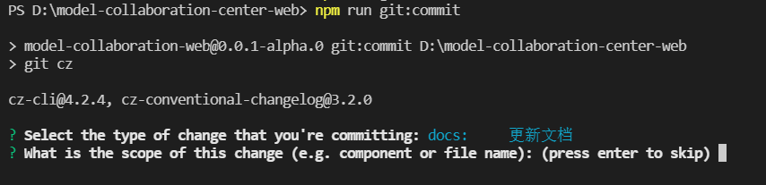

        3. 用精简的字数描述这次提交的标题，不可跳过
           - 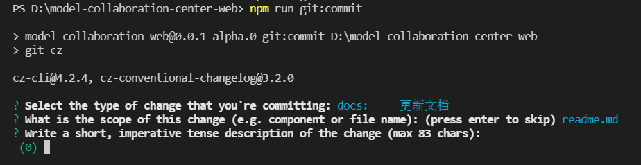

        4. 输入这次提交的详细描述,例：封装input公共组件，优化computed计算属性和整合通用函数等等，最好是越详细越好
           - 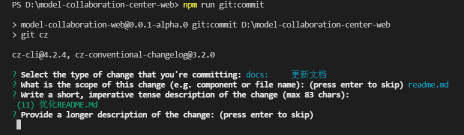

        5. 这次提交是否有突破性变化（是否不向下兼容）?直接回车，默认是no，如输入y，会更新项目主版本号
           - 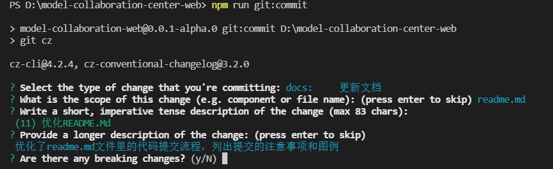

        6. 这次提交是否会影响任何公开问题？直接回车，默认是no,如果输入 y ，会有新的提示
           - 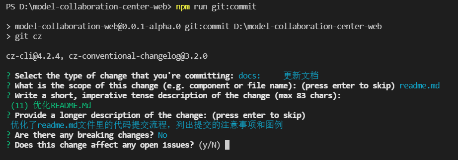
       
        7. 以上步骤操作完成之后，代码会自行push，运行git log，如可以打印出刚刚提交的日志，就说明git commit成功，例：
           - 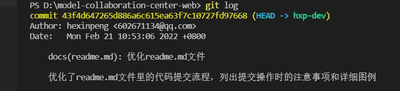

        8. 在终端运行`git push`命令(或者通过vscode选项板)提交commit文件，例：
           - 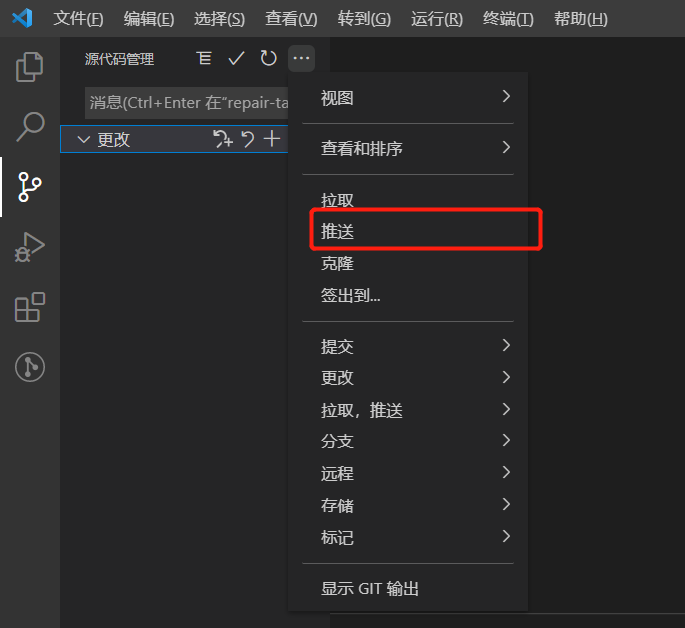

  - **代码合并请求**
      
      - 步骤：

        1. 根据链接地址打开代码仓库
           - 

           点击创建合并请求按钮，图例：
           - 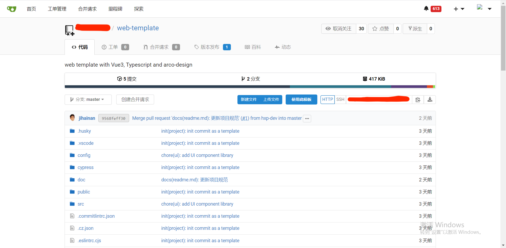
        
        2. 从下拉框中选择合并的目标分支
           - 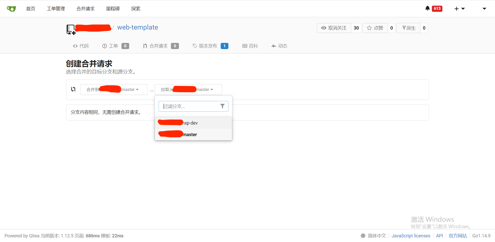

        3. 选中要合并分支后，会出现以下界面，表示这次提交修改的内容，然后点击创建合并请求按钮
        - 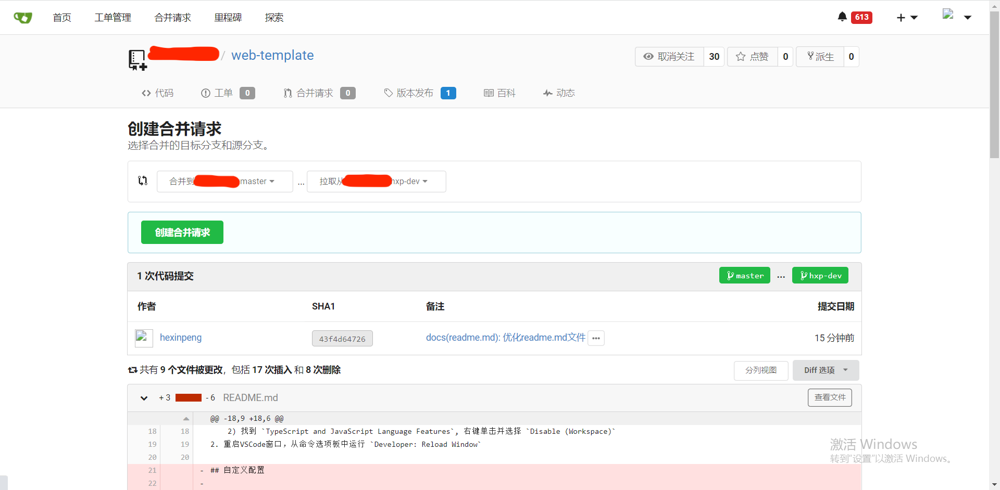

        4. 这里可以撰写和预览本次提交的文件，如已完成，直接点击创建合并请求按钮，完成代码合并请求操作流程
        - 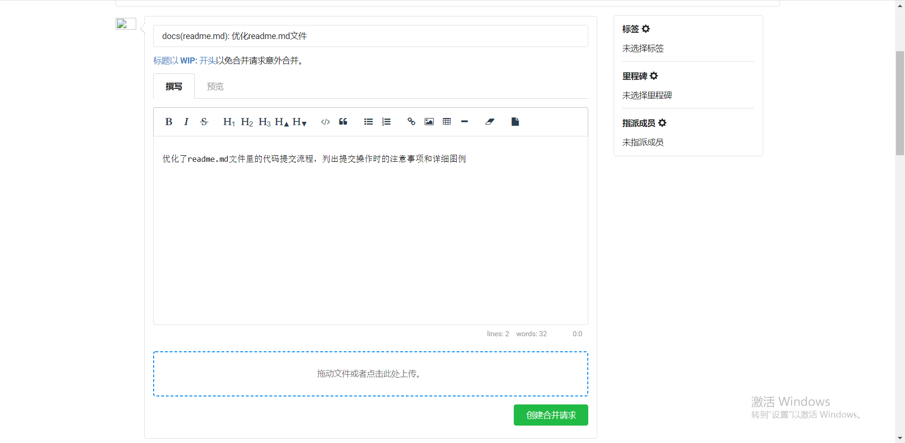

        5. 点击顶部导航栏合并请求按钮可查看成功创建的合并请求
        - 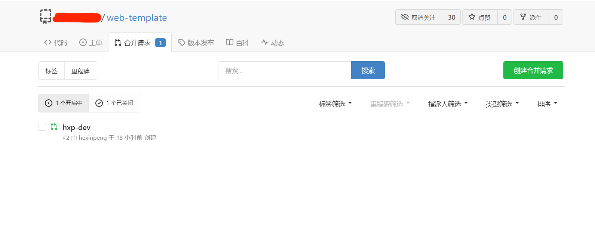

## 文件命名规范

- 所有组件或图片等其他文件命名需是小写加连字符，例如：hello-world.png, hello-world.vue等

